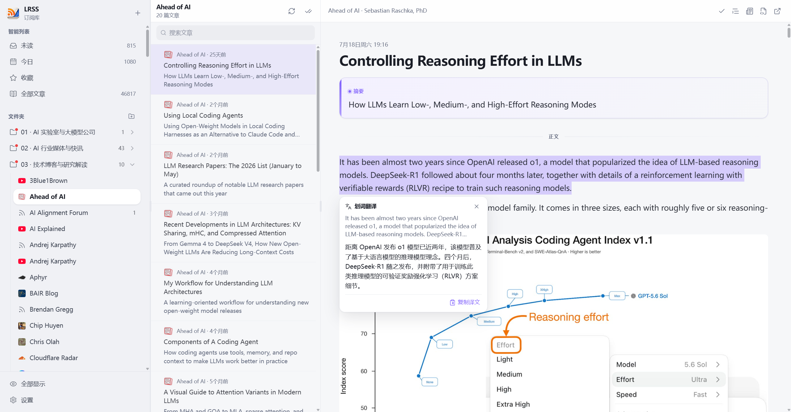
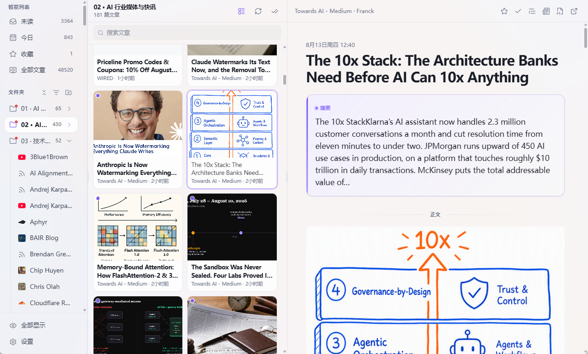

# LRSS

<p align="center">
  
</p>

<p align="center">
  <strong>本地优先的桌面 RSS 阅读器</strong><br />
  订阅拉取、搜索、可选 AI、YouTube 友好阅读，以及可选的局域网浏览器访问。
</p>

<p align="center">
  <a href="README.md">English</a>
</p>

---

## 界面截图

三栏资料库 · 文章列表 · 阅读器（摘要区、划词翻译、文件夹与智能列表）



文件夹 **图片卡片** 布局 — 封面铺开，可从列表顶栏或文件夹右键切换



---

## 功能

### 资料库与导航

| 能力 | 说明 |
| --- | --- |
| **三栏布局** | 侧栏（智能列表 / 文件夹 / 订阅）· 文章列表 · 阅读器 · 可选阅读助手 |
| **智能列表** | 未读 · 今日 · 收藏 · 全部 · 最近阅读 · 可选 **智能汇报** — 实时计数 |
| **文件夹** | 组织订阅；新建 / 重命名 / 删除；全部已读；刷新文件夹；移动订阅；可按文件夹切换 [列表 / 图片卡片](#文件夹展示) |
| **订阅源** | 图标、未读角标、右键菜单、单源编辑 |
| **办公 / 敏感模式** | 将源或文件夹标为敏感；开启办公模式后从侧栏与智能列表隐藏 |
| **禅模式** | 隐藏侧栏与列表，专注正文（`z`） |
| **可拖拽分栏** | 栏宽跨会话记忆 |

### 文件夹展示

图片类订阅适合卡片铺开。在文件夹上右键 → **展示模式 → 图片卡片**，或点文章列表顶栏刷新按钮左边的网格 / 列表图标。

- **列表** — 原来的标题 + 摘要行
- **图片卡片** — 封面网格（源图，或正文第一张图）。点卡片打开阅读器
- 设置存在文件夹上；其中的单个订阅会继承。智能列表仍是列表


### 订阅

| 能力 | 说明 |
| --- | --- |
| **添加订阅** | 单个或多个 RSS/Atom URL；导入时可批量标为敏感 |
| **刷新** | 单源 / 文件夹 / 全库；支持 ETag / Last-Modified |
| **自动刷新** | 全局间隔（分钟～小时）；可按源自定义间隔或暂停 |
| **OPML** | 导入 / 导出（OPML 2.0）；保留文件夹；重复导入合并 |
| **单源选项** | 显示名（用户锁定）、文件夹、刷新间隔、保留天数、暂停、敏感标记 |
| **失败源** | 仅看失败、一键删除无效订阅 |
| **保留策略** | 全局与按源保留天数（非收藏）；手动清理；**收藏永不清理** |

### 阅读

| 能力 | 说明 |
| --- | --- |
| **已读 / 收藏** | 切换状态；列表/文件夹全部标已读 |
| **打开标已读 / 滚到底标已读** | 可在设置中配置 |
| **最近阅读** | 打开文章即记入（与已读/未读无关）。保留条数在 **设置 → 通用**（10–200，默认 50）；超出的较早记录会被清理 |
| **精选** | **设置 → 过滤规则**。可选：刷新后由 AI 归档到侧栏「精选」**文章树**（不是订阅文件夹）。点根看全部，点子夹只看该夹。AI 只分进**已有**子夹名，对不上就放根，不会自己建夹。原文仍在原订阅里 |
| **智能汇报** | **设置 → AI 功能**。刷新产生新文后，大模型按主题提取变化；条目可点进原文。收藏的汇报出现在「收藏」中，不会被删除或清理 |
| **仅显示未读** | 列表隐藏已读（收藏、最近阅读与精选除外） |
| **打开原文** | 桌面用系统浏览器；Web 访问新开标签 |
| **正文外链** | 遵循「在浏览器中打开链接」设置 |
| **HTML 安全** | 入库/展示前经 bluemonday 消毒 |
| **请求全文** | 工具栏、后台排队或打开时自动抓取 — [技术说明](#抓取全文) |
| **排版** | 字号（小/中/大）、系统字体选择、阅读宽度（窄～铺满） |
| **阅读器工具栏** | 可配置：禅模式、收藏、已读、摘要、翻译、请求全文、Markdown、打开原文 |
| **Markdown 面板** | 将正文转为 Markdown 侧栏预览 |

### 抓取全文

不少订阅源只给摘要。LRSS 可以下载原文页，抽正文后替换本地存储。

**何时运行**

| 触发 | 入口 | 行为 |
| --- | --- | --- |
| 手动 | 阅读器工具栏 | 立即抓取该篇原文 URL |
| 新文章 | **设置 → 订阅 → 抓取全文** | 刷新后，看起来被截断的新文进入队列；与订阅刷新分开、限速消化 |
| 打开时 | **设置 → AI 功能 → 自动请求全文** | 打开文章时先做保守的「是否只有摘要」判断，再抓取。默认关 |

**流水线**（`internal/fulltext`）

1. **URL 策略** — 仅 `http`/`https`。拦截回环、RFC1918、IPv6 ULA、CGNAT（`100.64/10`）、链路本地、`.localhost` / `.local`、云 metadata。每次重定向再检查一遍（防 SSRF 出站）。
2. **下载** — [`enetx/surf`](https://github.com/enetx/surf)（`internal/httpx.Std`），指纹友好 TLS/HTTP，不用裸 `http.Client`。超时 45s，正文上限 8 MiB。
3. **抽取** — Mozilla [Readability](https://github.com/mozilla/readability) 算法，实现为 [`codeberg.org/readeck/go-readability/v2`](https://codeberg.org/readeck/go-readability)。抽出正文 HTML + 纯文本，去掉导航/广告等壳。
4. **消毒** — [bluemonday](https://github.com/microcosm-cc/bluemonday) UGC 策略后再写入 SQLite / 界面（与订阅源 HTML 相同）。
5. **入库** — 覆盖 `content_html` / `content_text`，标记 `fullContentFetched`，更新 FTS。

**截断启发式**（排队与自动抓取）只在本地、且偏保守：空正文、「阅读全文」类提示、或正文几乎等于源摘要。说不清的短文不动，请用工具栏。YouTube 观看页不走 Readability：字幕走 InnerTube → kkdai → 可选 `yt-dlp`，并保留阅读器内嵌播放器。

### 搜索与过滤

| 能力 | 说明 |
| --- | --- |
| **FTS5 全文** | 离线可用：标题 / 摘要 / 正文 |
| **语义搜索（可选）** | OpenAI 兼容 Embedding；可配置向量 / 混合模式 |
| **搜索模式** | auto · fts · vector · hybrid |
| **列表搜索** | 当前列表筛选；连接后端时走 FTS |
| **隐藏重复标题** | 可选 |
| **屏蔽关键词** | 逗号分隔，匹配标题/摘要则隐藏 |
| **智能精选** | 可选；刷新后由大模型判断，符合的文章进侧栏「精选」树。能对上已有子夹名则放入该夹，否则放根（不搬走订阅） |

### AI（可选，OpenAI 兼容）

需在 **设置 → 模型** 配置对话接口；功能开关在 **AI 功能**。

| 功能 | 入口 | 说明 |
| --- | --- | --- |
| **摘要** | 工具栏 | 正文上方流式摘要区；可选打开文章自动摘要 |
| **翻译** | 语言图标 | 原文 + 译文对照；**不删除原文** |
| **划词翻译** | 正文选中文字 | 弹层短文翻译 |
| **阅读助手** | 侧栏「阅读助手」 | 桌面与 Web 访问均可用的全局多轮对话。可添加当前文章、过滤/搜索订阅库，点击 `[n]` 跳到出处 |
| **智能精选** | 设置 → 过滤规则 | 刷新入库后按质量 + 兴趣画像归档到侧栏「精选」树；能对上已有子夹名则放入该夹，否则放根。不确定的不归档 |
| **标签 / 文件夹建议** | 助手建议条 | 本地关键词 + LLM；可一键移动订阅到文件夹 |
| **广告 / 软文判断** | 助手建议条 | 手动触发 organic / promo / unclear |
| **自动请求全文** | AI 功能开关 | 打开文章 → 保守 partial 判断 → 抓取页面 |
| **缓存** | 本地 SQLite | 文章 + 功能 + 模型 + 正文指纹 + 界面语言 |
| **语言跟随 UI** | 界面语言 | 中文界面 → 中文 prompt / 回复 |

向量（Embedding）与对话（LLM）**分开配置**，可指向不同网关/模型。

### YouTube

| 能力 | 说明 |
| --- | --- |
| **频道 RSS** | 视频条目内嵌播放 |
| **字幕** | 有则抓取；阅读器内 **时间轴 / 带时间戳字幕** |
| **抓取链路** | 观看会话 InnerTube（ANDROID/WEB/iOS）→ kkdai → 可选 **yt-dlp** |
| **失败保护** | 带时间轴升级失败时保留纯文本字幕 |
| **Cookies（可选）** | 环境变量 `YOUTUBE_TRANSCRIPT_COOKIES_FROM_BROWSER` 用于受限视频 |

### Web 访问（可选）

在 **设置 → 高级 → Web 访问** 中开启。

| 能力 | 说明 |
| --- | --- |
| **同一套 SPA** | 浏览器打开与桌面相同的阅读界面 |
| **绑定** | 仅本机（127.0.0.1）或 **局域网**（0.0.0.0） |
| **端口 / 令牌** | 默认端口 `18765`；Bearer 或 `?token=`；局域网空令牌自动生成 |
| **允许** | 浏览、收藏、已读、全部已读、搜索、桌面已开启的阅读器工具、**阅读助手**（与桌面共用同一套模型） |
| **禁止** | 设置界面、订阅/文件夹管理、刷新、OPML、同步管理 |
| **令牌无效** | 仅全屏提示页，不进入空资料库壳 |
| **语言** | 跟随桌面 UIPrefs 界面语言 |
| **开发构建** | `wails3 task dev` 不嵌入前端。Web 访问会反代 Vite（`FRONTEND_DEVSERVER_URL`）或读取 `frontend/dist`（先 `npm run build`）。正式版二进制已内嵌界面。 |

### 桌面与偏好

| 区域 | 说明 |
| --- | --- |
| **主题** | 跟随系统 / 浅色 / 深色；强调色预设 + 自定义色值 |
| **Windows 11 Mica** | 可选整窗 Mica（设置 → 外观）。22H2+；需要硬件加速。浏览器 Web 访问保持不透明。 |
| **Liquid Glass** | WWDC 2025 折射玻璃材质（CSS + SVG 位移图）。系统要求减少透明度时回退为普通模糊。 |
| **紧凑侧栏** | 更密的订阅列表 |
| **界面语言** | 简体中文 · English |
| **快捷键** | j/k 上下篇 · s 收藏 · m 已读 · r 刷新 · z 禅模式 · `,` 设置（可关） |
| **通知** | 新文章系统通知；声音开关；测试通知 |
| **同步（仅 OPML）** | WebDAV 或 S3 兼容（R2 / MinIO）；推送/拉取订阅结构 — **不含** 已读/收藏/正文 |
| **系统托盘** | 常驻托盘：打开窗口 · 刷新订阅 · 开启/关闭 Web 访问 · 退出 |
| **关闭到托盘** | 关闭窗口隐藏到托盘；从托盘菜单退出 |
| **高级** | 开机自启、硬件加速、清理 AI 缓存、导出诊断、重置界面设置 |
| **启动** | 默认列表；启动隐藏已读 |

### 隐私与数据

- **本地优先**：资料库在本机 SQLite，无需云账号
- **API Key** 仅存本机（界面脱敏）
- **出站 HTTP** 使用指纹友好客户端（`enetx/surf` / `internal/httpx`）
- 数据路径：XDG data home；Windows 安装版为 `%LOCALAPPDATA%/LRSS/data/lrss.db`。`wails3 task dev` 使用 `%LOCALAPPDATA%/LRSS-dev/`，可与安装版同时运行（可用 `LRSS_PROFILE` / `LRSS_DATA_DIR` 覆盖）

---

## 技术栈

| 层 | 技术 |
| --- | --- |
| Shell | [Wails v3](https://v3.wails.io) |
| 前端 | Vue 3 · TypeScript · Vite · Tailwind CSS v4 · [shadcn-vue](https://www.shadcn-vue.com) |
| 数据 | SQLite（[`modernc.org/sqlite`](https://pkg.go.dev/modernc.org/sqlite)）· FTS5 · 可选向量 |
| 出站 HTTP | [`github.com/enetx/surf`](https://github.com/enetx/surf)（`internal/httpx`） |
| 全文抽取 | [`go-readability/v2`](https://codeberg.org/readeck/go-readability)（Mozilla Readability）· [bluemonday](https://github.com/microcosm-cc/bluemonday) |
| 国际化 | vue-i18n（`zh-CN` / `en-US`） |

Go 模块路径：`lrss`。

---

## 环境要求

- **Go** 1.25+（开发环境常见 1.26）
- **Node.js** 20+
- **Wails CLI v3**

```bash
go install github.com/wailsapp/wails/v3/cmd/wails3@latest
```

YouTube 字幕回退可选：将 [`yt-dlp`](https://github.com/yt-dlp/yt-dlp) 加入 `PATH`。

---

## 下载 / 发布

推送版本标签后，GitHub Actions 会编译多平台产物并发布到 **Releases**：

| 资源 | 平台 |
| --- | --- |
| `lrss-<version>-windows-amd64.exe` / `.zip` | Windows x64 **绿色版** |
| `lrss-<version>-windows-amd64-setup.exe` | Windows x64 **安装包**（开始菜单 + 卸载） |
| `lrss-<version>-windows-arm64.exe` / `.zip` | Windows ARM64 **绿色版** |
| `lrss-<version>-windows-arm64-setup.exe` | Windows ARM64 **安装包** |
| `lrss-<version>-linux-amd64` | Linux x64 |
| `LRSS-<version>-macOS-arm64.app.zip` | **macOS Apple Silicon**（M1/M2/M3…） |
| `LRSS-<version>-macOS-amd64.app.zip` | **macOS Intel** |

**Windows：** 要安装版下 `-setup.exe`（快捷方式 + 程序和功能卸载）；绿色版下普通 `.exe` / `.zip`。**Windows / Linux** 绿色二进制会 **UPX 压缩**（体积大约减半）。**未做代码签名**；SmartScreen 可能提示「已保护你的电脑」——点 **更多信息** → **仍要运行**。

**macOS：** 标准 `.app`（CI ad-hoc 签名；无 universal / 无 UPX）。首次被拦截：右键 → **打开**。

```bash
# 推送到 GitHub 后打标签发版：
git tag v0.1.0
git push origin v0.1.0
```

工作流：[`.github/workflows/release.yml`](.github/workflows/release.yml)（也可 **Actions → Release → Run workflow**）。

仓库：[github.com/hakuzero4/LRSS](https://github.com/hakuzero4/LRSS)

---

## 快速开始

```bash
# 前端依赖
cd frontend && npm install && cd ..

# Go 服务变更后重新生成绑定
wails3 generate bindings

# 开发：原生窗口 + Vite 热更新
# 使用独立的 LRSS-dev 数据目录，可与已安装的 LRSS 同时开
wails3 task dev
```

生产构建：

```bash
wails3 task build   # 输出到 bin/
```

仅前端：

```bash
cd frontend && npm run dev    # http://127.0.0.1:9245
cd frontend && npm run build
```

测试：

```bash
go test ./...
```

### 常用命令

| 命令 | 说明 |
| --- | --- |
| `wails3 task dev` | 桌面端 + 热重载 |
| `wails3 task build` | 生产二进制 |
| `wails3 generate bindings` | 重新生成前端绑定 |
| `go test ./...` | 后端测试 |

---

## 配置对照

| 区域 | 设置入口 | 存储 |
| --- | --- | --- |
| 刷新、已读行为、敏感内容 | 通用 | SQLite UI 偏好 |
| 主题、强调色、语言、工具栏按钮 | 外观 | SQLite UI 偏好 |
| 字体、宽度、仅未读、外链打开方式 | 阅读 | SQLite UI 偏好 |
| OPML、订阅列表、保留策略 | 订阅 | SQLite + 文件 |
| 去重、屏蔽词 | 过滤规则 | SQLite UI 偏好 |
| Embedding + LLM 接口 | 模型 | SQLite settings |
| 自动摘要、自动全文等 | AI 功能 | SQLite UI 偏好 |
| WebDAV / S3 OPML 同步 | 同步 | SQLite settings |
| 快捷键开关 | 快捷键 | SQLite UI 偏好 |
| 新文章通知 | 通知 | SQLite UI 偏好 |
| Web 访问、缓存、诊断 | 高级 | SQLite + 运行时 |

详见：[docs/embedding.md](docs/embedding.md) · [docs/llm.md](docs/llm.md) · [docs/database.md](docs/database.md)

### Web 访问快速设置

1. **设置 → 高级 → 允许 Web 访问**
2. 选择 **仅本机** 或 **局域网**、端口、令牌
3. 复制本机 / 局域网链接（含 `?token=` 时请一并复制）
4. 在本机或同网浏览器中打开

---

## 架构概览

```text
main.go
├── appsvc/          Wails 门面（Feed / Article / Search / Settings / AI / Web）
├── service/         业务编排（拉取、OPML 等）
├── repo/            SQLite + FTS / 向量钩子
├── rss/             拉取与解析（gofeed）
├── search/          FTS + 可选向量
├── embed/ · llm/    OpenAI 兼容提供方
├── fulltext/        页抓取（surf）+ Readability 抽取 + 主机策略
├── web/             可选浏览器 HTTP API + SPA
├── ytcaptions/      YouTube 字幕后端
├── cloudsync/       OPML 推送/拉取（WebDAV / S3）
└── db/              打开库、迁移、向量扩展探测

frontend/
├── src/             Vue 应用（store、阅读器、设置、Web 门闸）
└── bindings/        由 Go 生成（经 loadAppsvc()）
```

---

## 文档

| 文档 | 内容 |
| --- | --- |
| [README.md](README.md) | English README |
| [docs/README.md](docs/README.md) | 文档索引 |
| [docs/database.md](docs/database.md) | 表结构、FTS、迁移、数据路径 |
| [docs/embedding.md](docs/embedding.md) | 向量搜索与 sqlite-vector |
| [docs/llm.md](docs/llm.md) | LLM 配置与 AI 功能 |
| [docs/screenshots/](docs/screenshots/) | 界面截图 |
| [docs/brand/](docs/brand/) | 应用图标源文件 |
| [AGENTS.md](AGENTS.md) | 贡献 / 多 Agent 约定 |

---

## 参与贡献

1. 改动尽量小而聚焦，并保证 `go test ./...` 通过。
2. 变更 Wails 暴露的 Go API 后，运行 `wails3 generate bindings`。
3. 出站 HTTP 使用 `internal/httpx`（生产路径勿裸写 `http.Client`）。
4. 文章 HTML 入库/展示前必须消毒。
5. 较大阶段工作见 [AGENTS.md](AGENTS.md)（本地计划目录 `docs/dev/plans/`，已 gitignore）。

---

## 许可证

尚未指定开源许可证。在添加 LICENSE 文件之前，保留所有权利。

---

基于 **Wails**、**Vue** 与 **SQLite** — 以离线友好的本地阅读为先。
